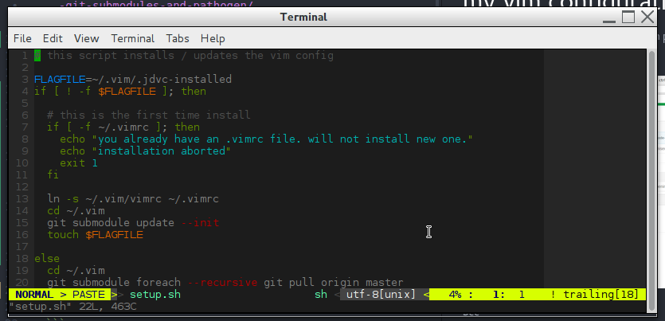

# my vim configuration
This is my personal vim configuration, with plugins included as git submodules and
the pathogen plugin manager.



See
  * http://vimcasts.org/episodes/synchronizing-plugins-with-git-submodules-and-pathogen/
  * https://github.com/tpope/vim-pathogen

for details.

# Used plugins
  *  [ctrlp](https://github.com/ctrlpvim/ctrlp.vim)
  *  [vim airline](https://github.com/vim-airline/vim-airline)
  *  [vim-colors-solarized](https://github.com/altercation/vim-colors-solarized.git)
  *  [vim-go](https://github.com/fatih/vim-go)

# Installation
Just run the setup script:
```
  git clone https://github.com/jandelgado/vimconfig.git ~/.vim &&\
  cd ~/.vim && sh setup.sh
```

or, manually:
```
  git clone --recursive https://github.com/jandelgado/vimconfig.git ~/.vim && ln -s ~/.vim/vimrc ~/.vimrc
```

## To add new plugins from github.com
```
  git submodule add https://github.com/module.git ~/.vim/bundle/module
  git checkout <tag>  # if you want to stick to specific version
  git add .
  git commit -m "added new plugin"
```
